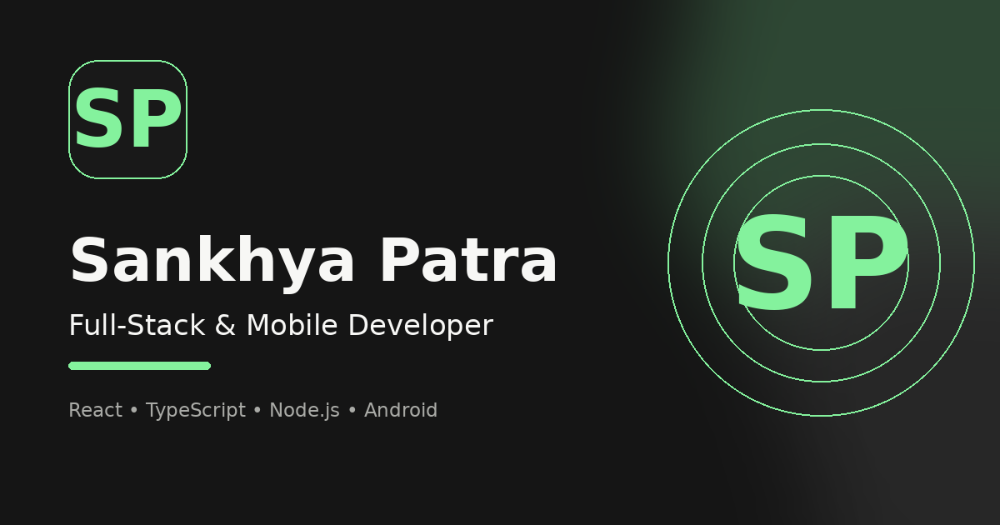

# Sankhya Patra — Personal Portfolio



A production-deployed full-stack portfolio presenting my background, capabilities and selected web and mobile projects, including SplitVerse, SplitVerse Mobile and DevArena.

## Live website

- Portfolio: https://personal-portfolio-flame-delta-42.vercel.app
- Source code: https://github.com/sankhyapatra0808/My_Portfolio
- Contact API: Render-hosted service configured through `VITE_API_URL`

## Main features

- Responsive homepage with full-screen desktop scroll snapping
- About, projects, archive and project-detail routes
- Accessible fullscreen navigation with keyboard focus trapping
- Skip-to-main-content support
- Route-level lazy loading with a Suspense fallback
- Optimized project and profile imagery
- Route-specific titles, descriptions and canonical metadata
- Open Graph and X/Twitter sharing metadata
- JSON-LD structured data for the person, website and project collection
- Favicons, application icons, web manifest, `robots.txt` and `sitemap.xml`
- React error boundary with a custom fallback screen
- Contact form backed by an Express and TypeScript API
- Brevo SMTP delivery with visitor reply-to support
- Server-side validation, request rate limiting, CORS allowlisting and a honeypot field
- Vercel Web Analytics integration

## Featured projects

### SplitVerse Website

A production-focused expense tracker and bill-splitting platform built around fair item-wise payments instead of equal-only splits. It includes split rooms, exact item allocation, adjusted settlements, wallet activity, transaction history, friends, notifications and production integrations.

### SplitVerse Mobile

An Expo and React Native Android application connected to the SplitVerse backend for dashboard, room, wallet, transaction, friends and settings workflows.

### DevArena

A developer-growth platform with authentication, activity logging, rankings, streaks, challenges, leaderboards and a contribution heatmap.

## Technology stack

### Frontend

- React
- TypeScript
- Vite
- React Router
- Handcrafted responsive CSS
- Vercel Web Analytics

### Backend

- Node.js
- Express
- TypeScript
- Nodemailer
- Brevo SMTP
- Express Rate Limit
- CORS

### Deployment

- Frontend: Vercel
- Backend: Render
- Source control: GitHub

## Repository structure

```text
personal_Portfolio/
├── frontend/
│   ├── public/
│   ├── src/
│   │   ├── assets/
│   │   ├── components/
│   │   ├── data/
│   │   ├── pages/
│   │   └── styles/
│   ├── index.html
│   ├── package.json
│   ├── vercel.json
│   └── vite.config.ts
├── backend/
│   ├── src/
│   │   ├── routes/
│   │   ├── utils/
│   │   └── index.ts
│   ├── package.json
│   └── tsconfig.json
├── .gitignore
├── ATTRIBUTION.md
├── LICENSE
└── README.md
```

## Local development

### Requirements

- Node.js 20 or newer
- npm
- A verified Brevo sender
- Brevo SMTP credentials

### Clone the repository

```bash
git clone https://github.com/sankhyapatra0808/My_Portfolio.git
cd My_Portfolio
```

### Recommended root setup

Install both frontend and backend dependencies from the repository root:

```bash
npm run setup
```

Then start both development servers together:

```bash
npm run dev
```

This starts the frontend on `http://localhost:5173` and the backend on `http://localhost:5000`.

You can also start them separately with `npm run dev:frontend` and `npm run dev:backend`.

### Frontend setup (alternative)

```bash
cd frontend
npm install
```

Create `frontend/.env.local`:

```env
VITE_API_URL=http://localhost:5000
VITE_SITE_URL=http://localhost:5173
```

Start the frontend:

```bash
npm run dev
```

The local frontend normally runs at `http://localhost:5173`.

### Backend setup

Open another terminal:

```bash
cd backend
npm install
```

Create `backend/.env`:

```env
NODE_ENV=development
PORT=5000
CLIENT_URLS=http://localhost:5173
PUBLIC_SITE_URL=http://localhost:5173
CONTACT_VERIFICATION_SECRET=replace_with_a_long_random_secret

BREVO_SMTP_HOST=smtp-relay.brevo.com
BREVO_SMTP_PORT=587
BREVO_SMTP_USER=YOUR_BREVO_SMTP_LOGIN
BREVO_SMTP_KEY=YOUR_BREVO_SMTP_KEY

EMAIL_FROM_NAME=Sankhya Portfolio
EMAIL_FROM_ADDRESS=YOUR_VERIFIED_BREVO_SENDER_EMAIL
PORTFOLIO_TO_EMAIL=YOUR_DESTINATION_EMAIL
```

Start the backend:

```bash
npm run dev
```

The backend normally runs at `http://localhost:5000` and exposes `GET /health`.

## Available commands

### Frontend

```bash
npm run dev
npm run lint
npm run build
npm run preview
```

### Backend

```bash
npm run dev
npm run typecheck
npm run build
npm start
```

## Contact API

The frontend sends contact requests to:

```text
POST /api/portfolio/contact
```

The backend validates the request, checks the honeypot field, applies rate limiting, sends the message through Brevo SMTP and sets the visitor email as the reply-to address.

## Security notes

- SMTP credentials are stored only in backend environment variables.
- Frontend `VITE_*` variables contain public deployment URLs only.
- CORS is restricted through the `CLIENT_URLS` allowlist.
- Contact requests are validated on the server.
- Request payload size is limited.
- Rate limiting reduces contact-form abuse.
- Real `.env` files are ignored by Git.

## Production deployment

### Render backend

```text
Root Directory: backend
Build Command: npm ci && npm run build
Start Command: npm start
Health Check: /health
```

### Vercel frontend

```text
Root Directory: frontend
Framework: Vite
Build Command: npm run build
Output Directory: dist
Install Command: npm ci
```

Production frontend variables:

```env
VITE_API_URL=YOUR_RENDER_BACKEND_URL
VITE_SITE_URL=https://personal-portfolio-flame-delta-42.vercel.app
```

Production backend CORS:

```env
CLIENT_URLS=https://personal-portfolio-flame-delta-42.vercel.app
```

## Accessibility and performance

The portfolio includes semantic landmarks, visible focus indicators, keyboard-operable navigation, Escape-key closing, focus restoration, reduced-motion handling, route-level code splitting, optimized image loading and responsive layouts.

## SEO and discovery

The portfolio includes route-specific metadata, canonical URLs, Open Graph tags, X/Twitter card tags, JSON-LD structured data, `robots.txt` and `sitemap.xml`.

## Licence and attribution

This project is distributed under the GNU General Public License v3.0. See [`LICENSE`](./LICENSE).

Third-party and reference-project acknowledgements are listed in [`ATTRIBUTION.md`](./ATTRIBUTION.md).

## Contact

- GitHub: https://github.com/sankhyapatra0808
- LinkedIn: https://www.linkedin.com/in/sankhyapatra
- Email: sankhyapatra0808@gmail.com
